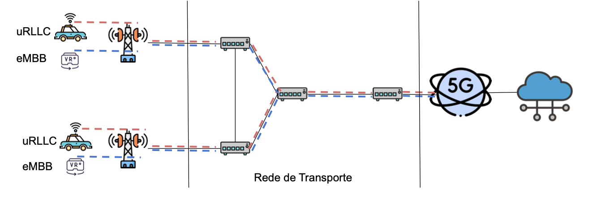

# Simulação de Rede 5G com Mininet para QoS de Tráfego eMBB e uRLLC

Este repositório contém uma simulação de rede 5G simplificada utilizando Mininet, focada na aplicação de políticas de Qualidade de Serviço (QoS) para diferenciar e priorizar tráfegos Enhanced Mobile Broadband (eMBB) e Ultra-Reliable Low-Latency Communication (uRLLC). A simulação monitora a latência do tráfego uRLLC e dinamicamente aplica regras de QoS (HTB + SFQ) nos roteadores de transporte para garantir os requisitos de baixa latência do uRLLC, enquanto gerencia o tráfego eMBB.

## Autores

* **[Talles Thomas Roodrigues Cavalcante]**
* **[Ian Lucas Oliveira Nunes]**

## Sumário
- [Visão Geral da Topologia](#visão-geral-da-topologia)
- [Funcionalidades Implementadas](#funcionalidades-implementadas)
- [Requisitos de Sistema](#requisitos-de-sistema)
- [Preparação do Ambiente](#preparação-do-ambiente)
- [Estrutura do Projeto](#estrutura-do-projeto)
- [Como Executar a Simulação](#como-executar-a-simulação)
- [Análise dos Resultados](#análise-dos-resultados)
- [Limpeza](#limpeza)

## Visão Geral da Topologia

A topologia Mininet simula uma rede com os seguintes componentes:

- **Hosts de Usuário (uRLLC e eMBB):** `h_uRLLC1`, `h_eMBB1`, `h_uRLLC2`, `h_eMBB2` conectados a switches de acesso.
- **Switches de Acesso (OVSKernelSwitch):** `s_access1`, `s_access2`.
- **Roteadores da Rede de Transporte (LinuxRouter):** `r_trans1`, `r_trans2`, `r_trans3`, `r_trans4`. Estes roteadores atuam como a espinha dorsal da rede, onde as políticas de QoS são aplicadas.
- **Host de Nuvem (`h_cloud`):** Simula um servidor remoto que recebe ambos os tipos de tráfego (eMBB e uRLLC).

As configurações de largura de banda para os links são:
- Links de Acesso: 50 Mbps
- Links de Transporte: 100 Mbps
- Link para a Nuvem: 200 Mbps



## Funcionalidades Implementadas

1.  **Geração de Tráfego:**
    * **uRLLC:** Tráfego UDP de baixa taxa de bits, mas com requisitos estritos de latência, simulado por `h_uRLLC2` para `h_cloud`.
    * **eMBB:** Tráfego UDP de alta largura de banda (45 Mbps), simulado por `h_eMBB1` para `h_cloud`.
2.  **Monitoramento de Latência uRLLC:** Um script (`gerador_monitor_uRLLC.py`) executa pings periódicos de `h_uRLLC1` para `h_cloud` e registra a latência. Se a latência exceder um limiar (5ms), um arquivo de alerta (`latencia.alerta`) é criado.
3.  **Controlador de QoS Dinâmico:** Um controlador (`controlador_qos.py`) monitora a existência do arquivo `latencia.alerta`.
    * **Ativação de QoS:** Se o arquivo de alerta é detectado, o controlador aplica regras de QoS bidirecionais (HTB - Hierarchical Token Bucket + SFQ - Stochastic Fairness Queueing) nas interfaces dos roteadores de transporte.
        * **Priorização:** Tráfego uRLLC (porta 5202) e ICMP (ping) são priorizados.
        * **Modelagem de Tráfego:** As classes HTB são configuradas para garantir largura de banda mínima e máxima para os diferentes tipos de tráfego, com SFQ para justa alocação dentro de cada classe, mitigando o bufferbloat.
    * **Desativação de QoS:** Se o arquivo de alerta não for mais detectado após um período de normalização (70 segundos), as regras de QoS são removidas, retornando a rede ao seu estado padrão.
4.  **Geração de Gráficos:** Um script (`grafico_monitor_urllc_v3.py`) gera automaticamente gráficos (PNG, GIF, MP4) da latência uRLLC ao longo do tempo, indicando os períodos em que o QoS esteve ativo.

## Requisitos de Sistema

* **Sistema Operacional:** Ubuntu 20.04 LTS (recomendado) ou ambiente Linux compatível com Mininet.
* **Mininet:** Versão 2.3.0d1 ou superior.
* **Python 3:** Com as bibliotecas `matplotlib`, `pandas`, `numpy`.
* **iperf3:** Ferramenta para geração de tráfego.
* **ffmpeg:** Para a geração de vídeos MP4 a partir dos gráficos (opcional, mas recomendado para os resultados visuais).

## Preparação do Ambiente

1.  **Atualizar o Sistema:**
    ```bash
    sudo apt update && sudo apt upgrade -y
    ```

2.  **Instalar Mininet:**
    ```bash
    git clone [https://github.com/mininet/mininet](https://github.com/mininet/mininet)
    mininet/util/install.sh -a # Instala tudo (Mininet, Open vSwitch, etc.)
    ```

3.  **Instalar iperf3:**
    ```bash
    sudo apt install iperf3 -y
    ```

4.  **Instalar dependências Python:**
    ```bash
    pip install matplotlib pandas numpy
    ```
    *Se `pip` não for encontrado, instale-o:* `sudo apt install python3-pip -y`

5.  **Instalar FFmpeg (para geração de vídeo MP4):**
    ```bash
    sudo apt install ffmpeg -y
    ```

## Estrutura do Projeto

* mininet_topologia_completa_v3.py # Script principal da topologia Mininet
* controlador_qos.py               # Lógica do controlador de QoS
* gerador_monitor_uRLLC.py         # Monitor de latência uRLLC
* gerador_trafego_embb.py          # Gerador de tráfego eMBB (iperf3 UDP)
* gerador_trafego_urllc.py         # Gerador de tráfego uRLLC (iperf3 UDP)
* grafico_monitor_urllc_v3.py      # Script para gerar gráficos e vídeos
* latencia.alerta                  # Arquivo de flag para ativação do QoS (criado/removido em tempo real)
* logs_embb/                       # Diretório para logs de tráfego eMBB
   * iperf_embb_log.txt
* logs_urllc/                      # Diretório para logs de tráfego uRLLC
   * iperf_urllc_h_uRLLC2_to_172.19.40.100.log
* urllc_log.txt                    # Log do monitor de latência uRLLC
* latencia_e_trafego.png           # Saída do gráfico (imagem)
* latencia_e_trafego.gif           # Saída do gráfico (GIF animado)
* latencia_e_trafego.mp4           # Saída do gráfico (vídeo)

## Como Executar a Simulação

1.  **Clonar o Repositório:**
    ```bash
    git clone <URL_DO_SEU_REPOSITORIO>
    cd <NOME_DO_SEU_REPOSITORIO>
    ```

2.  **Configurar o Diretório do Projeto:**
    O script `mininet_topologia_completa_v3.py` espera que o diretório base do projeto seja `/home/ubuntu/compartilhada`. Se você estiver executando em um local diferente, **você precisará editar a linha `project_dir`** no script `mininet_topologia_completa_v3.py` para apontar para o diretório raiz onde os arquivos do seu repositório estão localizados.

    Abra `mininet_topologia_completa_v3.py` e altere:
    ```python
    project_dir = "/home/ubuntu/compartilhada"
    ```
    para, por exemplo:
    ```python
    project_dir = os.path.dirname(os.path.abspath(__file__))
    ```
    Isso fará com que o script detecte o diretório atual como o `project_dir`.

3.  **Executar a Topologia Mininet:**
    Navegue até o diretório do projeto e execute o script principal com privilégios de superusuário:
    ```bash
    sudo python3 mininet_topologia_completa_v3.py
    ```

    O script fará o seguinte:
    * Construirá a topologia de rede Mininet.
    * Configurará IPs e rotas nos roteadores.
    * Iniciará o **Controlador de QoS** em uma thread separada.
    * Iniciará o **Monitor de Latência uRLLC** em `h_uRLLC1` em segundo plano.
    * Iniciará os servidores `iperf3` na nuvem (`h_cloud`) para eMBB (porta 5201) e uRLLC (porta 5202).
    * Iniciará os clientes `iperf3` em `h_eMBB1` (eMBB) e `h_uRLLC2` (uRLLC), gerando tráfego contínuo por 120 segundos.
    * Iniciará o **Gerador de Gráficos** em segundo plano, que monitorará os logs e atualizará os arquivos de saída (`.png`, `.gif`, `.mp4`).
    * Após a inicialização do tráfego e dos monitores, a simulação aguardará a duração total do teste (120 segundos + 10 segundos de buffer).
    * Finalmente, o prompt do Mininet CLI será exibido, permitindo interações manuais (você pode sair digitando `exit`).
    * Ao sair do CLI ou após o término automático, a rede será derrubada.

## Análise dos Resultados

Após a execução da simulação, os seguintes arquivos serão gerados no diretório do seu projeto:

* **`latencia_e_trafego.png`**: Uma imagem estática do gráfico final de latência uRLLC.
* **`latencia_e_trafego.gif`**: Um GIF animado mostrando a evolução da latência uRLLC ao longo do tempo.
* **`latencia_e_trafego.mp4`**: Um vídeo da evolução da latência uRLLC ao longo do tempo (requer ffmpeg).
* **`urllc_log.txt`**: Contém os logs do monitor de latência uRLLC (saída do `ping`).
* **`latencia.alerta`**: Este arquivo aparecerá e desaparecerá em tempo real, indicando os períodos em que a latência uRLLC excedeu o limite e o QoS foi ativado.
* **`logs_embb/iperf_embb_log.txt`**: Logs detalhados do cliente iperf3 para o tráfego eMBB.
* **`logs_urllc/iperf_urllc_h_uRLLC2_to_172.19.40.100.log`**: Logs detalhados do cliente iperf3 para o tráfego uRLLC.

**Interpretando os Gráficos:**
Observe os gráficos para identificar:
* Como a latência uRLLC se comporta.
* Os momentos em que a linha pontilhada vermelha (limite de 5ms) é cruzada, indicando degradação.
* As faixas alaranjadas no fundo do gráfico, que indicam os períodos em que as regras de QoS foram ativadas nos roteadores de transporte para tentar controlar a latência.
* A eficácia do controlador de QoS em trazer a latência de volta para dentro do limite aceitável após a sua ativação.

## Limpeza

Para remover os arquivos de log e os gráficos gerados, você pode usar os seguintes comandos:

```bash
rm -f latencia.alerta urllc_log.txt latencia_e_trafego.png latencia_e_trafego.gif latencia_e_trafego.mp4
rm -rf logs_embb logs_urllc
